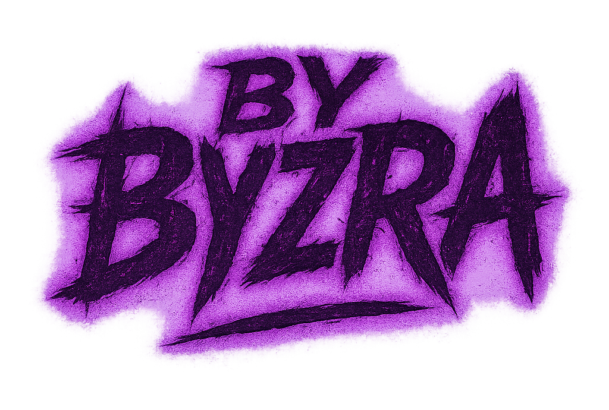

<p align="center">
  
</p>

<p align="center">
  <a href="https://golang.org"></a>
  <a href="https://opensource.org/licenses/MIT"></a>
  
  
  
  
</p>

---

<p align="center"><i><b>
Metadata dies where Anonymity begins.
</b></i></p>

---

**CALIGRA** is a CLI metadata control utility for Linux, built to sanitize, analyze, and optionally subvert file metadata. It provides tools to detect, remove, and manipulate metadata in various file formats to enhance privacy and security.

## Features

- **Metadata Analysis**: Examine files for sensitive metadata that could compromise privacy
- **Metadata Removal**: Thoroughly clean files of identifying information
- **Profile Injection**: Replace scrubbed metadata with consistent anonymized profiles
- **File Monitoring**: Daemon mode watches directories and processes new files automatically
- **Format Support**: Handles common image, audio, video, and text formats

## Installation

### Option 1: Download Pre-built Binary

Download the latest release for your platform:

<a href="https://github.com/username/caligra/releases/tag/v1.0.0">
  
</a>

```bash
# Extract and install
tar xzf caligra-1.0.0-linux-amd64.tar.gz
cd caligra-1.0.0
./install.sh
```

### Option 2: Build from Source

```bash
# Clone the repository
git clone https://github.com/username/caligra.git
cd caligra

# Run the installation script
./install.sh
```

### Prerequisites

Apart from Go 1.21+, CALIGRA requires these external tools:

1. **ExifTool**: for metadata extraction and manipulation
   - Debian/Ubuntu: `sudo apt install libimage-exiftool-perl`
   - Fedora: `sudo dnf install perl-Image-ExifTool`
   - Arch Linux: `sudo pacman -S perl-image-exiftool`

2. **FFmpeg**: for audio and video file handling
   - Debian/Ubuntu: `sudo apt install ffmpeg`
   - Fedora: `sudo dnf install ffmpeg`
   - Arch Linux: `sudo pacman -S ffmpeg`

Without these, functionality will be very limited.

## Usage

### Analyze File Metadata

Examine a file for metadata without modifying it:

```bash
caligra analyse caligra.png
```

Example output:
```
[✓] Analysis completed successfully
File: caligra.png
Type: image (image/png)

Detected Metadata:
• BitDepth: 8
• ColorType: RGB with Alpha
• Compression: Deflate/Inflate
• Directory: .
• ExifToolVersion: 13.25
• Filter: Adaptive
• ImageHeight: 954
• ImageSize: 684x954
• ImageWidth: 684
• Interlace: Noninterlaced
• MIMEType: image/png
• Megapixels: 0.653
• SourceFile: caligra.png

✓ No sensitive metadata detected
```

### Wipe Metadata

Remove metadata and inject a clean profile:

```bash
caligra wipe document.md
```

This creates `document.volena.md` with all metadata removed and replaced with the default profile.

Options:
- `--no-profile`: remove metadata without injecting a profile
- `--in-place`: modify file directly instead of creating a copy
- `--no-backup`: don't keep a backup of the original file
- `--secure`: securely overwrite original data to prevent recovery

### Daemon Mode

Monitor directories for new files and process them automatically:

```bash
# Start the daemon
caligra daemon on

# Check daemon status
caligra daemon status

# Stop the daemon
caligra daemon off
```

The daemon uses the config from `~/.caligra/config/scroud.toml`:

```toml
[watch]
paths = [
    # "/home/user/exports",
    # "/mnt/ops/dropzone",
    # "/srv/www/public"
]

[filter]
extensions = [".md", ".mp3", ".jpg"]
```

## Metadata Profiles

CALIGRA can inject consistent metadata profiles after wiping. The default profile is located at `~/.caligra/config/profile.lua`:

```lua
return {
    author = "nynynn",
    software = "liberty/1.0",
    created = "2000-05-01",
    organization = "Untraceable / Decentralized",
    location = "Stateless",
    comment = "Restructure everything"
}
```

This profile creates a communal signature, helping to anonymize and obscure your digital fingerprint while erasing forensic trails.

## Architecture

CALIGRA's architecture is built around a modular core called PURGE (Programmable Universal Resource Generic Erasure):

```
caligra/
├── cmd/caligra/          # entrypoint & command routing
├── internal/
│   ├── analyse/          # file analysis
│   ├── wipe/             # metadata removal
│   ├── daemon/           # directory monitoring
│   ├── formats/          # format-specific handlers
│   ├── config/           # config management
│   └── util/             # shared utils
└── config/               # default configs
└── install.sh            # installation script
```

### Format Support

CALIGRA currently supports:

- **Images**: JPG, PNG, GIF, TIFF, SVG
- **Audio**: MP3, FLAC, OPUS, OGG
- **Video**: MP4, AVI
- **Text**: TXT, MD, HTML

## Security Considerations

- CALIGRA creates backups by default to prevent data loss
- Files are verified after processing to ensure integrity
- The tool focuses on common metadata but cannot guarantee removal of all possible identifiers
- For maximum security, use with other privacy tools in a comprehensive OPSEC strategy

## Contributing

Contributions are welcome! Please feel free to submit pull requests or open issues to improve the tool.

## License

CALIGRA is released under the MIT License. See the [LICENSE](LICENSE) file for details.

> Part of [The BYZRA Series](https://github.com/bxavaby/byzra) ≡ a toolkit for surgical digital operations. Each tool in the series is designed to address specific needs while maintaining a consistent approach to security and usability.

---

<p align="center">
<i>Digital sovereignty through metadata control.</i>
</p>

---

<p align="center">
  <a href="https://github.com/bxavaby/BYZRA">
    
  </a>
</p>

